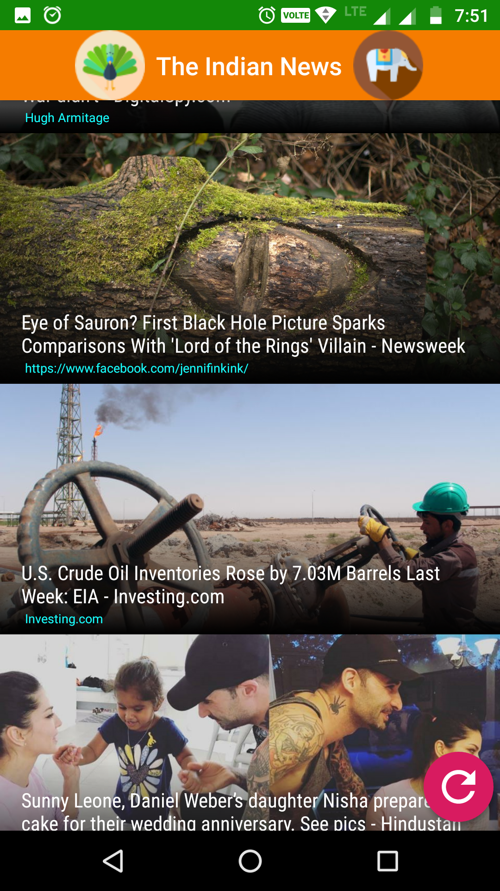

# The-Indian-News
A News application that uses News API to fetch the News articles and display them in app. News gets updated every half an hour in API so pressing the refresh button updates the news or if we open application after sometime again it automatically shows us the upadated news.
On clicking the news card, it shows us the description of the news and link to the news as well as a share option.

